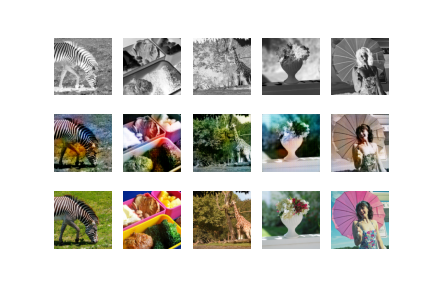
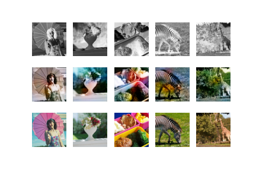

# Deep-Learning-Project-2
# Colorization of Greyscale Images Using Generational Adversarial Networks

## Abstract

## How to repeat the experiments
- Download the [Flickr8k](https://www.kaggle.com/adityajn105/flickr8k) or the [Flickr30k](https://www.kaggle.com/hsankesara/flickr-image-dataset) to the working directory
- Make sure you have Python 3.8.5 installed
- `python -m pip install --upgrade pip`
- `pip install -r requirements.txt`
- Run the preprocessing scripts; `pre_processing.py` and then `generate_black_and_white_images.py`
- Run the updated `pix2pix.ipynb` script

## Folder Description
- **preprocessing**: 
	`preprocessing.py` goes through a selected folder containing the image dataset, crops these images to `128x128x3`. It then shuffles and saves the dataset. `generate_black_and_white_images.py` creates and saves the greyscale versions of the images. 

- **pix2pix**: Utilized model 

- **Alternate considered model**: Contains an implementation of a model for the same task.

## Results
## Loss progression
 
## Flickr8k Model
Top - Greyscale image, Middle - model generated image, Bottom - Ground Truth
 
## Flickr30k Model
Top - Greyscale image, Middle - model generated image, Bottom - Ground Truth
 

## Authors
- [Brown Ogum](https://github.com/brown532)
- [Cosmin Roger Harsulescu](https://github.com/cosminroger)
- [Lars Cordes](https://github.com/L-Cordes)
- [Valentin Alexandru Tanase](https://github.com/ValyT)

