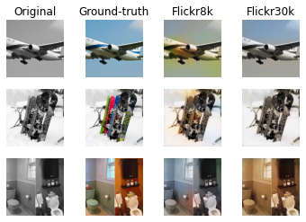

# Deep-Learning-Project-2
# Colorization of Greyscale Images Using Generational Adversarial Networks

## Abstract
Image restoration is a process which deals with recovering an original image from a degraded version. It has many applications, from denoising to coloring black and white photos, which are especially relevant for improving historical photographs and videos. This latter application is implemented here using a Conditional Generative Adversarial Network (cGAN). cGANs have produced promising results for restoring degraded images in recent years. This paper reports specifically on the steps taken to train a cGAN for color restoration in greyscale images. We compare the performance of the model when trained on two image data sets, Flickr8k and Flickr30k. We further compare the results of different regularization techniques for training the cGAN by computing the disparity of the generated color image from the ground truth. It was observed that the cGAN performed reasonably well for both data sets, with the disparity between the generated image and the ground truth being less than 7 percent for all data sets and architectural configurations. The cGAN produced better results when operating on the Flickr30k dataset. Additionally, the images approximated the ground truth color images, indicating that the cGAN had, to some degree, determined the manifold describing natural color images.

## How to repeat the experiments
- Download the [Flickr8k](https://www.kaggle.com/adityajn105/flickr8k) or the [Flickr30k](https://www.kaggle.com/hsankesara/flickr-image-dataset) to the working directory
- Make sure you have Python 3.8.5 installed
- `python -m pip install --upgrade pip`
- `pip install -r requirements.txt`
- Run the preprocessing scripts; `pre_processing.py` and then `generate_black_and_white_images.py`
- Run the updated `pix2pix.ipynb` script

## Folder Description
- **preprocessing**: 
	`preprocessing.py` goes through a selected folder containing the image dataset, crops these images to `128x128x3`. It then shuffles and saves the dataset. `generate_black_and_white_images.py` creates and saves the greyscale versions of the images. 

- **pix2pix**: Utilized model 

- **Alternate considered model**: Contains an implementation of a model for the same task.

## Results
### Loss progression
 
### Model trained on Flickr8k dataset and Flickr30k dataset
 
 
 
 

## Authors
- [Brown Ogum](https://github.com/brown532)
- [Cosmin Roger Harsulescu](https://github.com/cosminroger)
- [Lars Cordes](https://github.com/L-Cordes)
- [Valentin Alexandru Tanase](https://github.com/ValyT)

## References
- Flickr8k and Flickr30k (see paper)
- [pix2pix](https://phillipi.github.io/pix2pix/)

